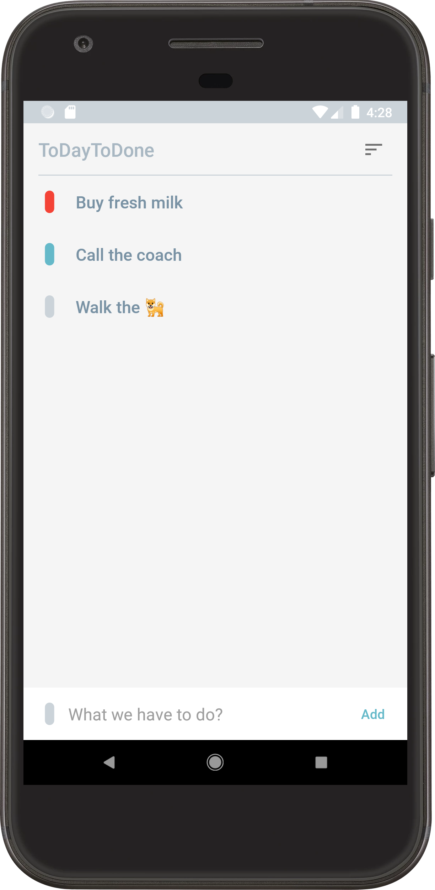
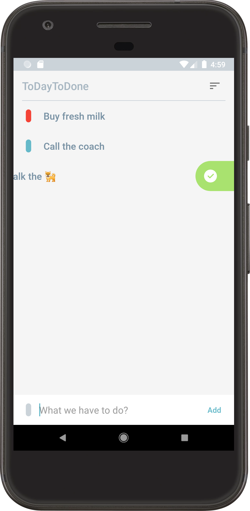
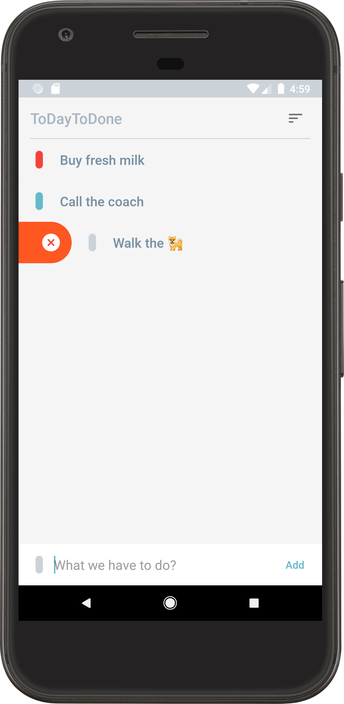
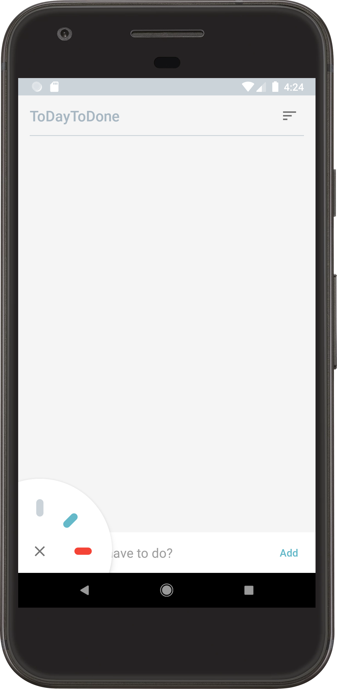
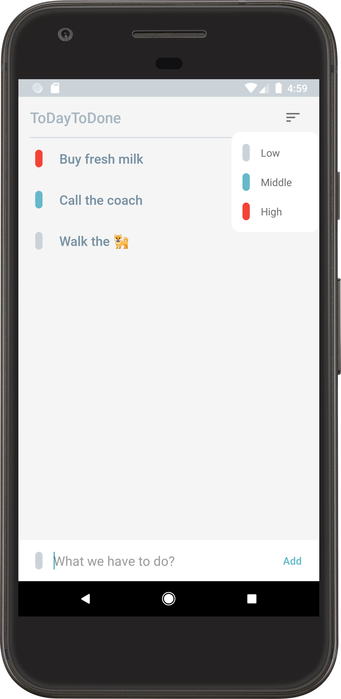

# ToDayToDone
Project for Android Study Jam. Voronezh. December 2020

## [Video(Rus)](https://www.youtube.com/watch?v=m-uduajhODE&ab_channel=GDGVoronezh)

## **What?**
1. Inflate list with [ListAdapter](https://developer.android.com/reference/androidx/recyclerview/widget/ListAdapter)
2. Custom ViewGroup
3. Custom View
4. Custom PopUp
5. Swipe RecyclerViews' Items with [ItemTouchHelper.Callback](https://developer.android.com/reference/kotlin/androidx/recyclerview/widget/ItemTouchHelper.Callback)**
6. Nice animations
7. Use [Android Architecture Components](https://developer.android.com/topic/libraries/architecture)

Items list | Done swipe | Remove swipe | Color picker | Sort popup
------------ | ------------- | ------------- | ------------- | -------------
 |  |  |  | 
